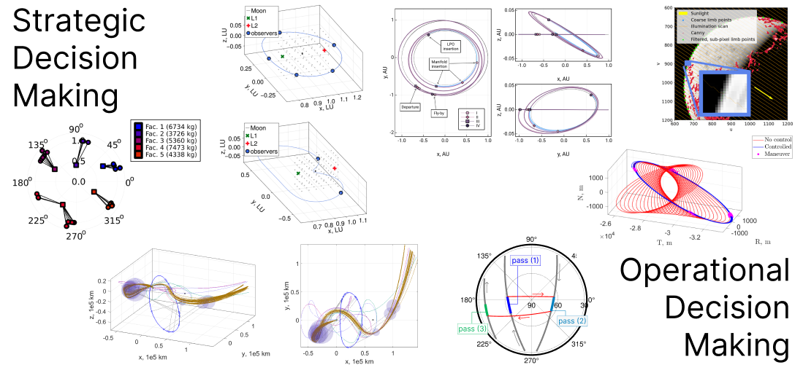

I am a PhD candidate in the [**Space Systems Optimization Group (SSOG)**](https://ssog.ae.gatech.edu/) at **Georgia Tech**, supervised by Professor Koki Ho. 
The overarching theme of my research interest is **decision making** - this includes:

1. *strategic decisions* for designing in-space infrastructures or designing space missions and multi-mission campaigns, and
2. *operational decisions* for operating spacecraft (or fleet of spacecraft) to perform its mission, autonomously or semi-autonomously. 

In effect, my research lies at the intersection of Space Logistics, Astrodynamics, and Guidance, Navigation & Control (GNC). 

  

Prior to my PhD, I completed my alma mater at **Imperial College London** with a Master's in aeronautical engineering (MEng) and a year abroad at the **University of California, Los Angeles (UCLA)**. 
In the past, I have worked on the **design of low-energy transfers** to low-lunar orbits as part of the mission analysis team at [ispace](https://ispace-inc.com/), **GNC on cislunar libration point orbit missions** at [Mitsubishi Electric Research Laboratories (MERL)](https://www.merl.com/), and **G&C for rendez-vous with geostationary satellite** at [Infinite Orbits](https://www.infiniteorbits.io/). 

In my free time, I took part in the 11th and 12th editions of the **Global Trajectory Optimisation Competition (GTOC)** as part of the Advanced Concepts Team at ESTEC, finishing up on the second and fourth place, respectively.
In my non-research-oriented free time, I enjoy shooting film photographs, playing tennis, and reading. 

**Research keywords**: Astrodynamics, GNC, Optimal Control, Location Problems, Routing Problems, Scheduling Problems

**Featured research work**: 

- [Facility Location Problem for On-Orbit Servicing Depot (Journal of Spacecraft and Rockets)](https://arc.aiaa.org/doi/full/10.2514/1.A35691)
- [Optimization-Based Station-Keeping on Libration Point Orbits (AAS Astrodynamics Specialist Conference)](https://www.merl.com/publications/docs/TR2024-109.pdf)
- [Horizon-Based Optical Navigation for NRHO (74th International Astronautical Congress)](https://www.merl.com/publications/docs/TR2023-128.pdf)

## Education

* Ph.D in Aerospace Engineering, **Georgia Institute of Technology**, 2021 - present
* Year Abroad in Aerospace Engineering, **University of California - Los Angeles**, 2018 - 2019
* MEng in Aeronautical Engineering, **Imperial College London**, 2016 - 2020

## Work experience

* **Flight Dynamics Intern**, [**Infinite Orbits**](https://www.infiniteorbits.io/), Toulouse, France (2024/05 - 2024/08)
  * Formulated concepts of operations for far-range rendez-vous in GEO
  * Developed guidance logic for semi-autonomous and ground-based rendez-vous transfers

* **Spacecraft GNC Intern**, [**Mitsubishi Electric Research Laboratories**](https://www.merl.com/), Cambridge, MA (2023/05 - 2023/08)
  * Developed GNC stack for autonomous navigation and control in cislunar space
  * Developed synthetic imaging tool for horion-based optical navigation

* **Mission Analysis Intern**, [**ispace, inc.**](https://ispace-inc.com/), Tokyo, Japan (2020/05 - 2020/12)
  * Led preliminary design and characterization of low-energy transfers to the Moon in three- and four-body models
  * Conducted review activities for critical design review (CDR) of mission analysis team

* **Mission Analysis Intern**, [**ispace, inc.**](https://ispace-inc.com/), Tokyo, Japan (2019/08 - 2019/09)
  * Developed Python interface between JPL’s astrodynamics library MONTE and visualization Cosmographia

## Publications

Please see [here](/publications/)

## Projects

* [Glocal Trajectory Optimisation Competition (GTOC) 12](https://gtoc12.tsinghua.edu.cn/), 2023/06 - 2023/07
  * Participated as part of ESA's Advanced Concepts Team & Friends, 4th place overall

* [Caltech Space Challenge](https://www.spacechallenge.caltech.edu/description), 2022/03
  * One-week competition to design a sample return mission to Titan
  * Conducted Mission analysis and trajectory design in both interplanetary and Saturnian systems

* [Glocal Trajectory Optimisation Competition (GTOC) 11](https://gtoc11.nudt.edu.cn/GTOC?page=home), 2021/11
  * Participated as part of Team 6. ESA ACT & Friends, 2nd place overall

## Contact

- Email: yuri.shimane{at}gatech.edu
