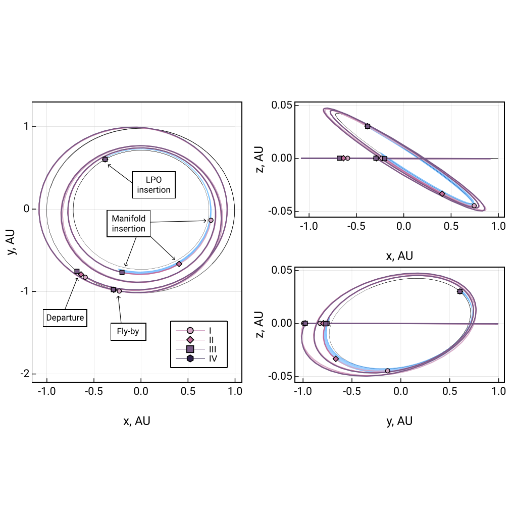

## 1. Low-Thrust Transfers Leveraging Manifold Structures

When traveling across multiple planetary or moon systems, invariant manifold structures may be leveraged to allow for efficient transfer within multi-body dynamics. However, the sole use of these structures is restrictive in many cases, as the manifold may not reach a desired departure or arrival location in the phase space. In particular, the use of low-thrust propulsion together with manifold dynamics requires an optimization framework that captures these mechanisms into a single problem. 

This work proposes an approach to design gravity-assist low-thrust transfers that lever- age manifold structures at departure or arrival. The approach involves a modification to the Sims-Flanagan transcription by incorporating parametrization of arrival to a manifold Poincaré section instead of a celestial body. A key advantage is its use of two-body dynamics for the propagation of the majority of the transfer. This enables large-scale and realistic assessment of possible solutions through a combination of ODE-based propagation of the manifold, and Lagrange coefficients-based propagation of the inter-system portion of the transfer. Leveraging the proposed method, a low-thrust transfer from Earth to the Sun-Venus system, also incorporating an Earth fly-by in between, is studied. 

  

#### Related publication:

- Shimane, Y., & Ho, K. (2022). **Gravity‑Assist Low‑Thrust Inter‑System Trajectory Design with Manifold Captures**. The Journal of the Astronautical Sciences. [https://doi.org/10.1007/s40295-022-00319-x](https://doi.org/10.1007/s40295-022-00319-x) ([access paper](https://rdcu.be/cKPdk))